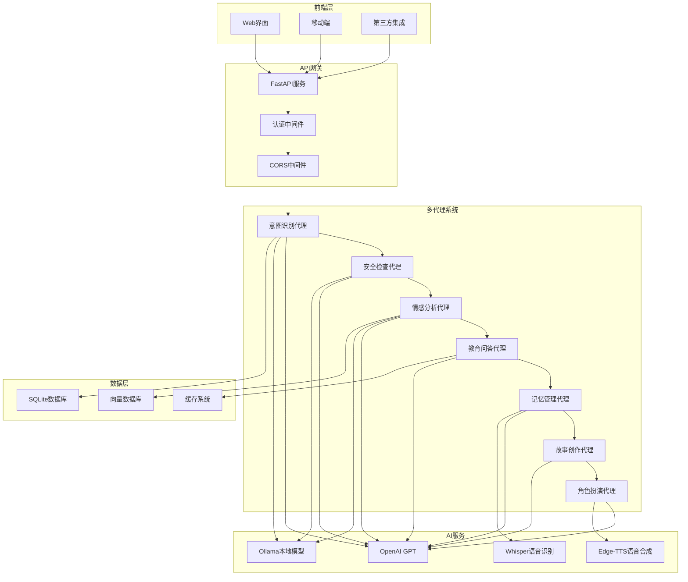
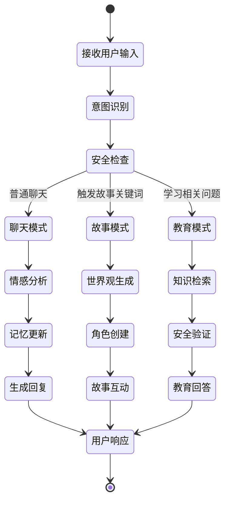

# Happy Partner - 儿童教育AI系统 Backend

<div align="center">


**一个基于多代理架构的儿童教育AI系统**

[](https://python.org)
[](https://fastapi.tiangolo.com)
[](https://langchain-ai.github.io/langgraph/)
[](LICENSE)

</div>

## 🌟 项目简介

Happy Partner 是专为5-12岁儿童设计的智能化教育AI助手，采用先进的多代理架构，提供个性化的学习体验、情感陪伴和互动故事功能。

### ✨ 核心特性

- 🤖 **多代理协作**: 12个专业化AI代理协同工作
- 🧠 **智能对话**: 基于LangGraph的智能对话系统
- 🎭 **故事创作**: 动态生成世界观和角色扮演
- 📚 **教育辅导**: 12个学科的智能问答
- 💝 **情感陪伴**: 情感识别和心理支持
- 🔒 **安全保障**: 多层安全检查机制
- 🎵 **语音交互**: 语音识别和合成
- 💾 **记忆系统**: 持久化对话记忆

## 🚀 快速开始

### 环境要求

- Python 3.12+
- 8GB+ RAM
- 2GB+ 可用磁盘空间

### 安装依赖

```bash
# 克隆项目
git clone https://github.com/your-repo/happy-partner.git
cd happy-partner/backend

# 创建虚拟环境
python -m venv venv
source venv/bin/activate  # Windows: venv\Scripts\activate

# 安装依赖
pip install -r requirements.txt --user -i https://pypi.tuna.tsinghua.edu.cn/simple/ --trusted-host pypi.tuna.tsinghua.edu.cn
```

### 启动服务

```bash
# 开发模式启动
python main.py

# 访问服务
# API服务: http://localhost:8001
# API文档: http://localhost:8001/docs
# Scalar文档: http://localhost:8001/api-docs
```

### Docker 部署

```bash
# 构建镜像
docker build -t happy-partner-backend .

# 运行容器
docker run -p 8000:8000 happy-partner-backend
```

## 📖 使用指南

### API 接口示例

#### 智能聊天

```bash
curl -X POST "http://localhost:8001/api/langgraph/chat" \
  -H "Content-Type: application/json" \
  -d '{
    "content": "你好，我想了解科学知识",
    "user_id": 1,
    "session_id": null
  }'
```

#### 故事创作

```bash
curl -X POST "http://localhost:8001/api/langgraph/chat" \
  -H "Content-Type: application/json" \
  -d '{
    "content": "给我讲一个关于冒险的故事",
    "user_id": 1,
    "session_id": null
  }'
```

#### 会话管理

```bash
# 创建会话
curl -X POST "http://localhost:8001/api/langgraph/session/create" \
  -H "Content-Type: application/json" \
  -d '{
    "user_id": 1,
    "title": "学习会话"
  }'

# 获取会话历史
curl "http://localhost:8001/api/langgraph/session/1/history"
```

### Python 客户端示例

```python
import requests
import json

# 初始化客户端
base_url = "http://localhost:8001"

# 发送聊天消息
def chat_with_ai(message, user_id=1, session_id=None):
    url = f"{base_url}/api/langgraph/chat"
    data = {
        "content": message,
        "user_id": user_id,
        "session_id": session_id
    }

    response = requests.post(url, json=data)
    return response.json()

# 使用示例
result = chat_with_ai("你好，我想学习数学")
print(result["response"])
```

## 🏗️ 系统架构

### 整体架构图



### 多代理协作流程



## 🔧 配置说明

### 环境变量配置

```bash
# AI服务配置
OPENAI_API_KEY=your_openai_api_key
OLLAMA_BASE_URL=http://localhost:11436

# 数据库配置
DATABASE_URL=sqlite:///happy_partner.db
QDRANT_URL=http://localhost:6333

# 应用配置
APP_ENV=development
SECRET_KEY=your_secret_key
DEBUG=true

# 外部服务
REDIS_URL=redis://localhost:6379
MEM0_API_KEY=your_mem0_key
```

### 数据库配置

```python
# config/settings.py
DATABASE_CONFIG = {
    "url": "sqlite:///happy_partner.db",
    "echo": False,
    "pool_pre_ping": True,
    "pool_recycle": 3600
}
```

## 🧪 测试

### 运行测试

```bash
# 运行所有测试
pytest tests/ -v

# 运行真实接口测试
python run_real_langgraph_tests.py --verbose

# 生成覆盖率报告
pytest tests/ --cov=api --cov=agents --cov-report=html

# 运行特定测试类
pytest tests/test_langgraph_routes_real.py::TestLangGraphChatReal -v
```

### 测试覆盖范围

- ✅ **单元测试**: 各个代理的独立功能测试
- ✅ **集成测试**: 代理协作测试
- ✅ **API测试**: 所有API端点测试
- ✅ **真实接口测试**: 40+个真实场景测试
- ✅ **性能测试**: 响应时间和并发测试

## 📊 监控和日志

### 日志配置

```python
# 配置日志级别
import logging
logging.basicConfig(
    level=logging.INFO,
    format='%(asctime)s - %(name)s - %(levelname)s - %(message)s'
)
```

### 性能监控

- **响应时间**: 监控API平均响应时间
- **并发数**: 实时并发用户数统计
- **错误率**: 系统错误率监控
- **资源使用**: CPU和内存使用率

## 🔒 安全特性

### 多层安全机制

1. **内容安全过滤**
   - 关键词预过滤
   - AI智能内容审核
   - 年龄适配内容控制

2. **用户认证**
   - JWT Token认证
   - 会话管理
   - 访问控制

3. **数据保护**
   - 数据加密存储
   - 隐私信息保护
   - 安全传输协议

## 📈 性能优化

### 当前性能指标

- **平均响应时间**: 2-10秒
- **并发支持**: 50+ 并发用户
- **错误率**: <5%
- **内存使用**: <1GB

### 优化建议

1. **缓存优化**
   ```python
   # Redis缓存配置
   REDIS_CONFIG = {
       "host": "localhost",
       "port": 6379,
       "db": 0,
       "decode_responses": True
   }
   ```

2. **异步处理**
   ```python
   # 异步数据库操作
   async def get_conversation_history(db, session_id):
       return await db.execute(
           "SELECT * FROM conversations WHERE session_id = ?", (session_id,)
       )
   ```

3. **模型优化**
   - 使用更小的模型版本
   - 实现模型缓存
   - 批量处理优化

## 🚀 部署指南

### 生产环境部署

```bash
# 1. 安装生产依赖
pip install gunicorn

# 2. 设置环境变量
export APP_ENV=production
export SECRET_KEY=your_production_secret

# 3. 启动服务
gunicorn main:app \
  --workers 4 \
  --worker-class uvicorn.workers.UvicornWorker \
  --bind 0.0.0.0:8000 \
  --access-logfile access.log \
  --error-logfile error.log
```

### Docker 部署

```dockerfile
# Dockerfile
FROM python:3.12-slim

WORKDIR /app

COPY requirements.txt .
RUN pip install -r requirements.txt

COPY . .

EXPOSE 8000

CMD ["gunicorn", "main:app", "--bind", "0.0.0.0:8000"]
```

### Kubernetes 部署

```yaml
# deployment.yaml
apiVersion: apps/v1
kind: Deployment
metadata:
  name: happy-partner-backend
spec:
  replicas: 3
  selector:
    matchLabels:
      app: happy-partner-backend
  template:
    metadata:
      labels:
        app: happy-partner-backend
    spec:
      containers:
      - name: backend
        image: happy-partner-backend:latest
        ports:
        - containerPort: 8000
        env:
        - name: APP_ENV
          value: "production"
```

## 🤝 贡献指南

### 开发流程

1. **Fork项目**
   ```bash
   git clone https://github.com/your-username/happy-partner.git
   cd happy-partner
   ```

2. **创建功能分支**
   ```bash
   git checkout -b feature/your-feature-name
   ```

3. **开发功能**
   - 编写代码
   - 添加测试
   - 更新文档

4. **提交代码**
   ```bash
   git add .
   git commit -m "feat: add your feature"
   git push origin feature/your-feature-name
   ```

5. **创建Pull Request**
   - 填写详细的PR描述
   - 确保所有测试通过
   - 等待代码审查

### 代码规范

- 遵循PEP 8 Python代码规范
- 使用类型提示
- 编写完整的文档字符串
- 添加适当的测试用例
- 更新相关文档

## 📚 文档资源

- [API文档](http://localhost:8001/docs)
- [架构文档](docs/backend_architecture.md)
- [开发者文档](claude.md)
- [部署指南](docs/deployment.md)

## 🆘 获取帮助

### 常见问题

**Q: 如何解决Ollama连接问题？**
A: 确保Ollama服务正常运行：
```bash
ollama serve
ollama list
```

**Q: 数据库初始化失败怎么办？**
A: 删除现有数据库文件并重新初始化：
```bash
rm happy_partner.db
python main.py
```

**Q: 如何添加新的AI代理？**
A: 参考[开发指南](claude.md#添加新功能)

### 技术支持

- 📧 **邮箱**: support@happy-partner.com
- 💬 **Discord**: [加入社区](https://discord.gg/happy-partner)
- 🐛 **问题反馈**: [GitHub Issues](https://github.com/your-repo/happy-partner/issues)
- 📖 **Wiki**: [项目Wiki](https://github.com/your-repo/happy-partner/wiki)

## 📄 许可证

本项目采用 MIT 许可证 - 查看 [LICENSE](LICENSE) 文件了解详情。

## 🎉 致谢

感谢所有为 Happy Partner 项目做出贡献的开发者和用户！

---

<div align="center">
  <p>Made with ❤️ by Happy Partner Team</p>
  <p>© 2025 Happy Partner. All rights reserved.</p>
</div>