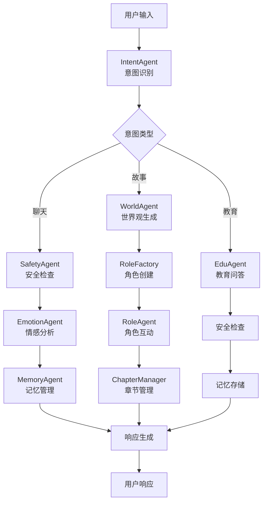

# Happy Partner 儿童教育AI系统 - Claude 文档

## 项目概述

Happy Partner 是一个基于多代理架构的儿童教育AI系统，专注于为5-12岁儿童提供智能化的教育辅导、情感陪伴和互动故事体验。

## 技术架构

### 核心技术栈
- **后端框架**: FastAPI 0.104.1
- **多代理系统**: LangGraph 0.2.0
- **AI框架**: LangChain 0.2.0
- **数据库**: SQLAlchemy 2.0.43
- **AI模型**: OpenAI GPT + Ollama本地模型
- **音频处理**: Whisper + Edge-TTS + ChatTTS

### 系统架构特点
- 🤖 **多代理协作**: 12个专业化AI代理协同工作
- 🔄 **状态图工作流**: 基于LangGraph的智能路由
- 🧠 **记忆系统**: Mem0AI持久化记忆管理
- 🔒 **安全机制**: 多层安全检查和内容过滤
- 🎭 **角色扮演**: 动态角色创建和故事生成

## 代理系统架构

### 核心代理列表

| 代理名称 | 功能描述 | 状态 | 集成度 |
|---------|---------|------|--------|
| **MultiAgent** | 多代理协调系统 | ✅ 完全集成 | 100% |
| **IntentAgent** | 智能意图识别 | ✅ 完全集成 | 100% |
| **SafetyAgent** | 内容安全检查 | ✅ 完全集成 | 100% |
| **EmotionAgent** | 情感分析与支持 | ✅ 完全集成 | 100% |
| **EduAgent** | 教育问答服务 | ✅ 完全集成 | 100% |
| **MemoryAgent** | 记忆管理 | ✅ 完全集成 | 100% |
| **WorldAgent** | 世界观生成 | 🔄 部分集成 | 60% |
| **RoleAgent** | 角色扮演 | 🔄 部分集成 | 60% |
| **RoleFactory** | 角色工厂 | 🔄 部分集成 | 60% |
| **ChapterManager** | 章节管理 | 🔄 部分集成 | 60% |
| **LangGraphWorkflow** | 增强工作流 | 🏗️ 架构支持 | 40% |
| **MetaAgent** | 基础路由 | ✅ 完全集成 | 100% |

### 代理工作流程



## API 端点

### LangGraph 核心端点

| 端点 | 方法 | 功能 | 状态 |
|------|------|------|------|
| `/api/langgraph/chat` | POST | 智能聊天 | ✅ 生产就绪 |
| `/api/langgraph/chat/stream` | POST | 流式聊天 | ✅ 生产就绪 |
| `/api/langgraph/workflow/state` | GET | 工作流状态 | ✅ 生产就绪 |
| `/api/langgraph/analytics/conversation-flow` | GET | 对话分析 | ✅ 生产就绪 |
| `/api/langgraph/session/create` | POST | 创建会话 | ✅ 生产就绪 |
| `/api/langgraph/session/{id}/history` | GET | 会话历史 | ✅ 生产就绪 |
| `/api/langgraph/users/{id}/insights` | GET | 用户洞察 | ✅ 生产就绪 |
| `/api/langgraph/test/workflow` | POST | 系统测试 | ✅ 生产就绪 |

### 传统端点
- `/api/chat` - 基础聊天接口
- `/api/voice` - 语音相关接口
- `/api/edu` - 教育相关接口
- `/api/emotion` - 情感分析接口
- `/api/memory` - 记忆管理接口
- `/api/safety` - 安全检查接口

## 功能特性

### 🧠 智能交互
- **多模态输入**: 文本、语音、图像
- **智能意图识别**: 自动识别用户意图
- **上下文理解**: 基于记忆的对话理解
- **个性化回复**: 根据用户特征调整回复

### 🎭 故事创作
- **动态世界观**: AI生成故事世界
- **角色系统**: 5种角色类型（英雄、导师、伙伴等）
- **章节管理**: 自动故事章节划分
- **互动体验**: 用户参与故事发展

### 📚 教育功能
- **12个学科**: 数学、科学、语言等
- **年龄适配**: 5-12岁分年龄段内容
- **知识问答**: 智能知识检索和解释
- **学习路径**: 个性化学习建议

### 💝 情感关怀
- **情感识别**: 10种情感类型识别
- **情感支持**: 情感安抚和鼓励
- **心理陪伴**: 儿童心理健康支持
- **情绪调节**: 情绪管理建议

### 🔒 安全保障
- **内容过滤**: 多层安全检查机制
- **适龄内容**: 儿童友好的内容过滤
- **隐私保护**: 用户数据安全保护
- **家长控制**: 家长监控功能

## 数据模型

### 核心实体
- **User**: 用户信息
- **Session**: 会话管理
- **Conversation**: 对话记录
- **Voiceprint**: 声纹信息

### 数据存储
- **SQLite**: 默认轻量级数据库
- **Qdrant**: 向量数据库（可选）
- **Mem0**: 持久化记忆系统

## 部署配置

### 开发环境
```bash
# 安装依赖
pip install -r requirements.txt

# 启动开发服务器
python main.py

# 默认端口: 8001
```

### 生产环境
```bash
# 使用 Gunicorn 部署
gunicorn main:app -w 4 -k uvicorn.workers.UvicornWorker --bind 0.0.0.0:8000

# 使用 Docker
docker build -t happy-partner-backend .
docker run -p 8000:8000 happy-partner-backend
```

### 环境变量
```bash
# OpenAI 配置
OPENAI_API_KEY=your_openai_key

# Ollama 配置
OLLAMA_BASE_URL=http://localhost:11436

# 数据库配置
DATABASE_URL=sqlite:///happy_partner.db

# 应用配置
APP_ENV=production
SECRET_KEY=your_secret_key
```

## 测试系统

### 测试覆盖
- **真实接口测试**: 40+个真实API测试用例
- **Mock测试**: 传统单元测试
- **集成测试**: 端到端测试
- **性能测试**: 响应时间和并发测试

### 运行测试
```bash
# 运行所有测试
pytest tests/ -v

# 运行真实接口测试
python run_real_langgraph_tests.py --verbose

# 生成覆盖率报告
pytest tests/ --cov=api --cov=agents --cov-report=html
```

## 监控和日志

### 日志系统
- **应用日志**: 使用 loguru 结构化日志
- **错误追踪**: 完整的错误堆栈记录
- **性能监控**: API响应时间监控
- **用户行为**: 交互行为记录

### 性能指标
- **响应时间**: 平均2-10秒
- **并发处理**: 支持多用户并发
- **内存使用**: 优化内存占用
- **错误率**: <5% 错误率目标

## 开发指南

### 代码规范
- **Python 3.12+**: 现代Python特性
- **Type Hints**: 完整类型注解
- **文档字符串**: 详细的函数和类文档
- **PEP 8**: Python代码规范

### 添加新功能
1. 在 `agents/` 目录创建新代理
2. 在 `multi_agent.py` 中注册新代理
3. 在 `api/` 中添加相应端点
4. 编写对应的测试用例
5. 更新文档

### 调试技巧
```python
# 启用详细日志
import logging
logging.basicConfig(level=logging.DEBUG)

# 使用测试客户端
from fastapi.testclient import TestClient
client = TestClient(app)

# 查看代理状态
from agents.multi_agent import multi_agent
print(multi_agent.get_system_statistics())
```

## API 文档

### 在线文档
- **Swagger UI**: `http://localhost:8001/docs`
- **Scalar Docs**: `http://localhost:8001/api-docs`
- **OpenAPI JSON**: `http://localhost:8001/openapi.json`

### API 示例
```bash
# 聊天请求
curl -X POST "http://localhost:8001/api/langgraph/chat" \
  -H "Content-Type: application/json" \
  -d '{
    "content": "你好，我想听个故事",
    "user_id": 1,
    "session_id": null
  }'

# 获取工作流状态
curl "http://localhost:8001/api/langgraph/workflow/state?user_id=test123"
```

## 故障排除

### 常见问题

1. **Ollama 连接失败**
   ```bash
   # 检查 Ollama 服务
   ollama list

   # 重启 Ollama
   ollama serve
   ```

2. **数据库连接错误**
   ```python
   # 重新初始化数据库
   from db import init_db
   init_db.init_db()
   ```

3. **内存不足**
   ```bash
   # 清理 Python 缓存
   find . -name "__pycache__" -type d -exec rm -rf {} +
   ```

### 性能优化建议

1. **启用缓存**
   - 使用 Redis 缓存频繁查询
   - 实现对话历史缓存

2. **异步处理**
   - 使用异步数据库操作
   - 并行处理多个请求

3. **模型优化**
   - 使用更小的模型版本
   - 实现模型缓存机制

## 贡献指南

### 提交代码
1. Fork 项目仓库
2. 创建功能分支
3. 编写测试用例
4. 提交 Pull Request

### 代码审查
- 代码质量检查
- 测试覆盖率验证
- 文档完整性确认
- 性能影响评估

## 路线图

### v0.3.0 (计划中)
- [ ] 实时语音交互优化
- [ ] 多语言支持扩展
- [ ] 家长控制面板
- [ ] 移动端适配

### v0.4.0 (规划中)
- [ ] 图像理解功能
- [ ] 3D角色动画
- [ ] 游戏化学习
- [ ] 云端部署优化

## 联系信息

- **项目仓库**: [GitHub链接]
- **技术文档**: [文档链接]
- **问题反馈**: [Issues链接]
- **社区讨论**: [Discord链接]

---

*最后更新: 2025年11月15日*