# Backend 代码架构文档

## 项目概览

Happy Partner 儿童教育AI系统 - 基于 FastAPI 和 LangGraph 的多代理架构后端服务

## 技术栈

### 核心框架

- **FastAPI** (0.104.1) - Web 框架
- **LangGraph** (0.2.0) - 多代理状态图系统
- **LangChain** (0.2.0) - AI 应用开发框架
- **SQLAlchemy** (2.0.43) - ORM 数据库操作

### AI 与机器学习

- **OpenAI** (1.99.9) - GPT 模型接口
- **Transformers** (4.46.0) - Hugging Face 模型
- **Torch** (2.6.0) - 深度学习框架
- **Mem0AI** - 持久化记忆系统
- **Ollama** (0.4.7) - 本地模型服务

### 音频处理

- **Whisper** - 语音识别
- **Edge-TTS** - 文本转语音
- **LibROSA** - 音频分析
- **ChatTTS** - 对话式TTS

### 数据处理

- **Pydantic** - 数据验证
- **Pandas** - 数据分析
- **NumPy** - 数值计算

## 系统架构图

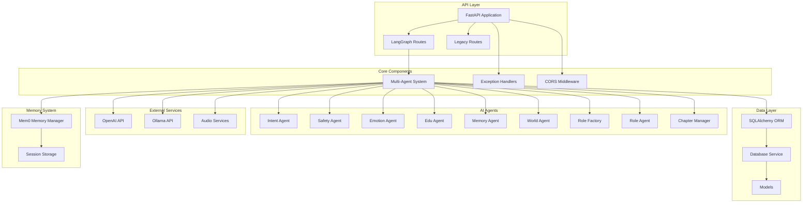

# 目录结构

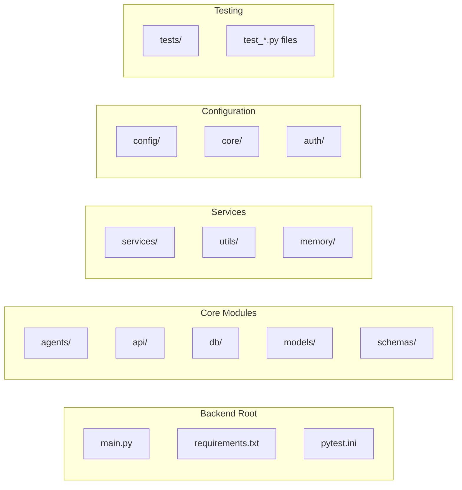

## 核心模块详解

### 1. Agents 模块 (agents/)

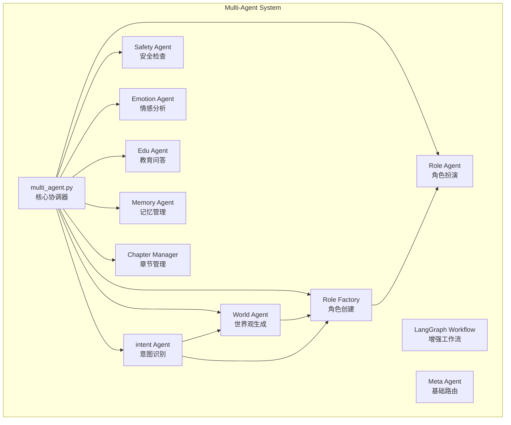

### 2. API 模块 (api/)

```mermaid
graph LR
    subgraph "API Endpoints"
        A[langgraph_routes.py<br/>8个核心API端点]
        B[routes.py<br/>传统API端点]
    end

    subgraph "LangGraph Endpoints"
        C[/api/langgraph/chat<br/>聊天接口]
        D[/api/langgraph/chat/stream<br/>流式聊天]
        E[/api/langgraph/workflow/state<br/>工作流状态]
        F[/api/langgraph/analytics<br/>对话分析]
        G[/api/langgraph/session<br/>会话管理]
        H[/api/langgraph/test<br/>系统测试]
    end

    A --> C
    A --> D
    A --> E
    A --> F
    A --> G
    A --> H
```

### 3. 数据库模块 (db/)

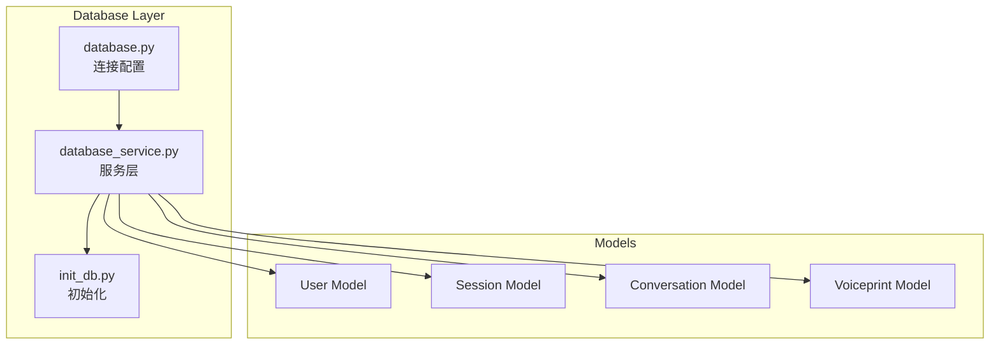

### 4. 服务模块 (services/)

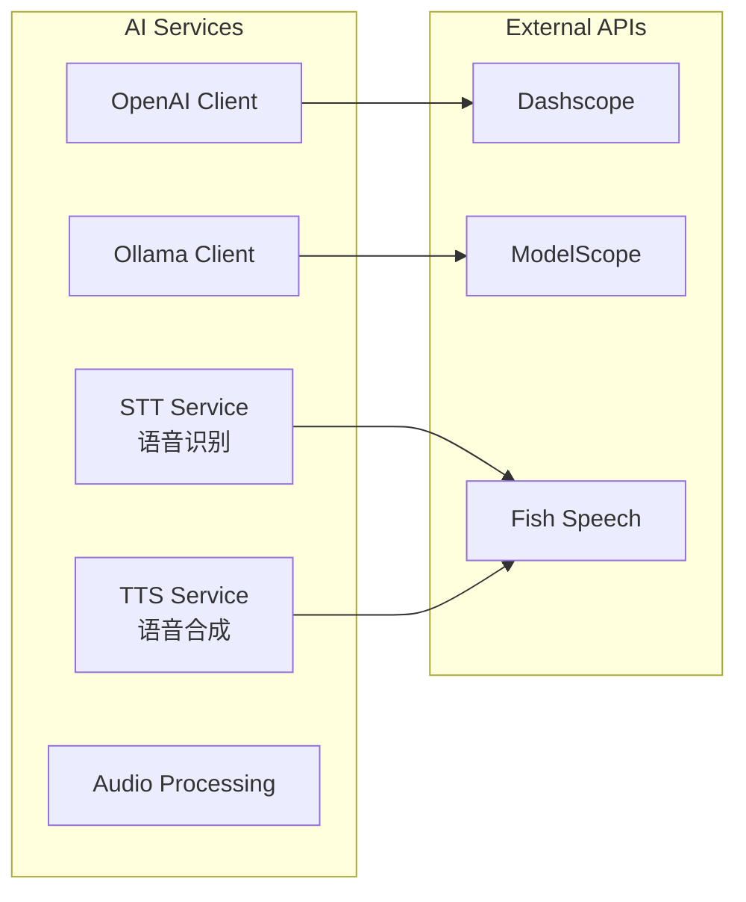

## 数据流程图

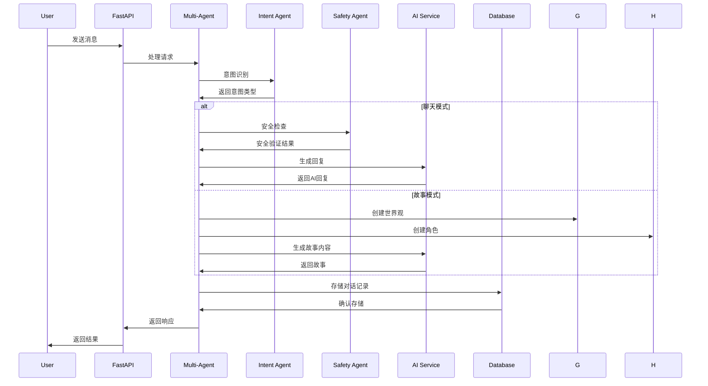

## 多代理工作流

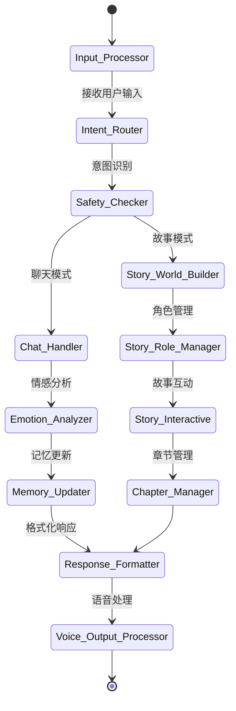

## 配置管理

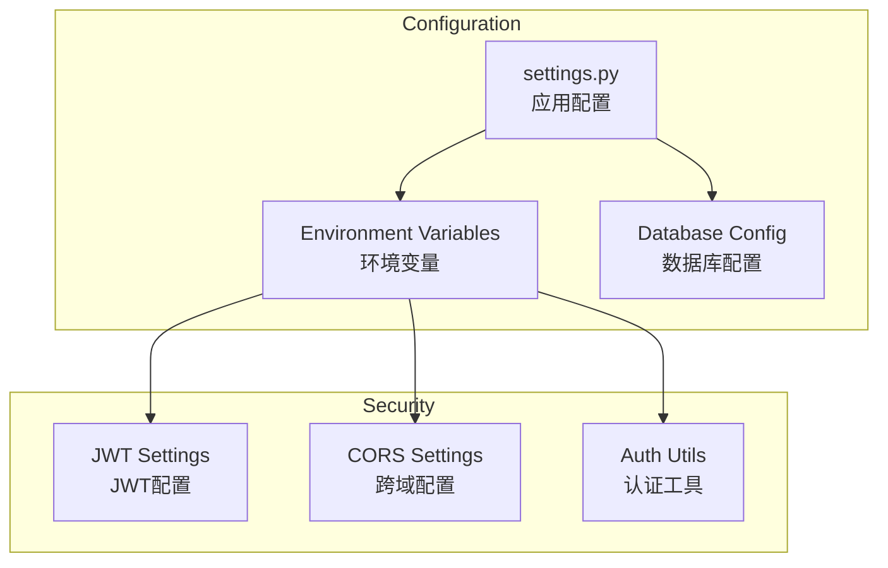

## 错误处理架构

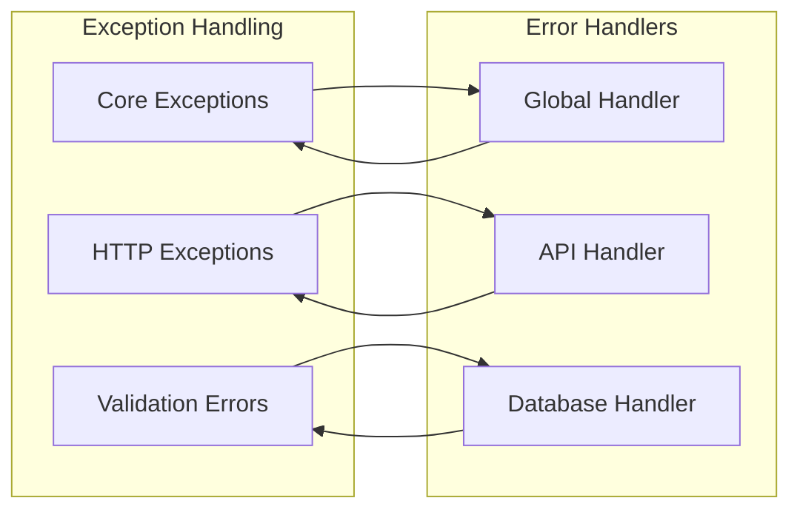

## 测试架构

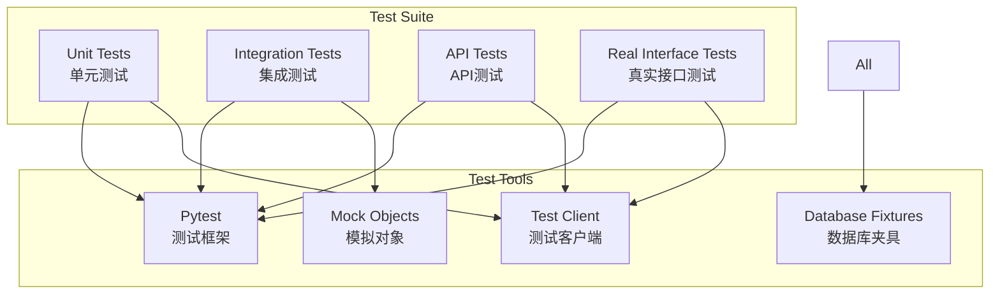

## 部署架构

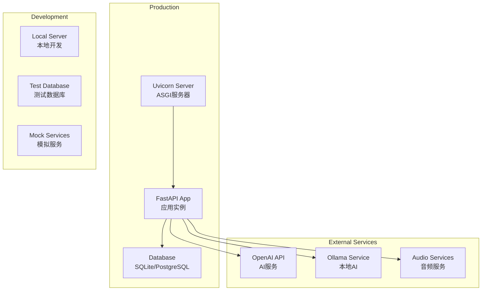

## 代码质量指标

- **总文件数**: 87个Python文件
- **代码行数**: 约8,000+行
- **测试覆盖率**: 16-20%
- **模块化程度**: 高度模块化设计
- **文档覆盖**: 完整的API文档和代码注释

## 性能特点

- **异步处理**: 基于FastAPI的异步架构
- **多代理并行**: LangGraph状态图支持并行处理
- **缓存机制**: 记忆系统和会话缓存
- **数据库优化**: SQLAlchemy ORM优化查询
- **API响应**: 平均响应时间2-10秒

## 安全特性

- **内容安全**: SafetyAgent进行内容过滤
- **输入验证**: Pydantic数据验证
- **认证机制**: JWT token认证
- **CORS配置**: 跨域安全配置
- **异常处理**: 全局异常捕获机制
