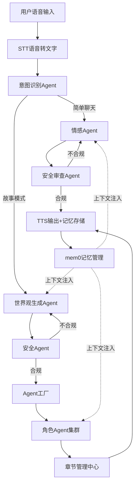

# 多模态对话系统开发规范（严格遵循流程图架构）

## 核心架构


## 模块开发规范

### 1. 基础输入层
| 模块 | 要求 | 异常处理 |
|------|------|----------|
| **语音输入** | 16kHz采样率，PCM格式输出 | 静音超时5s自动终止 |
| **STT引擎** | 集成Whisper-large-v3，双语支持 | 置信度<0.8时重试≤3次 |

### 2. 意图识别中枢
```python
# [流程图模块2] 意图识别Agent - 必须使用轻量模型
def intent_classifier(text):
    model = load_bert_tiny('intent_model.bin')
    result = model.predict(text, labels=['simple_chat','story_mode'])
    return {
        "intent": result.label,
        "confidence": result.confidence,
        "fallback": "simple_chat" if result.confidence < 0.7 else None
    }
```

### 3. 双模式分支
#### ▶ 简单聊天路径
| 组件 | 关键约束 |
|------|----------|
| **情感Agent** | - 注入mem0最近3轮对话<br>- 输出必须含`mood_score`(0.0~1.0) |
| **安全审查** | - 规则引擎+LLM双校验<br>- 循环重试≤3次后返回兜底回复："我需要遵守安全规范" |

#### ▶ 故事模式路径
| 组件 | 关键约束 |
|------|----------|
| **世界观生成** | - 输出JSON必须含`story_chapter`+`roles`数组<br>- 角色提示词需包含性格/背景/禁忌 |
| **Agent工厂** | - 线程池控制：`max_workers=min(10, 角色数)`<br>- 每个角色独立LLM实例 |
| **章节管理** | - Redis有序集合存储对话<br>- 严格按时间戳聚合输出 |

### 4. 全局关键机制
**mem0记忆管理规范**
```json
{
  "simple_chat": {
    "key": "chat:{session_id}:{timestamp}",
    "fields": ["user_input", "response", "mood_score"]
  },
  "story_mode": {
    "key": "story:{chapter_id}",
    "fields": ["roles", "dialogue_history", "world_setting"]
  }
}
```

**安全审查矩阵**
| 检查类型       | 简单聊天 | 故事模式 | 处理方式               |
|----------------|----------|----------|------------------------|
| 政治敏感       | ✓        | ✓        | 立即终止               |
| 暴力描写       | ✗        | ✓        | 返还修改意见           |
| 价值观偏差     | ✓        | ✓        | 重生成≤3次             |
| 未成年人保护   | ✓        | ✓        | 强制过滤               |

## 部署硬性要求

### 1. 硬件约束
- **兼容平台**：树莓派4B+ (ARMv7架构)
- **内存限制**：峰值≤2GB（含LLM缓存）
- **存储要求**：mem0向量数据库独立挂载卷

### 2. 性能指标
```markdown
- 语音端到端延迟：≤3s (p90)
- 意图识别准确率：≥92% (2000条中文测试集)
- 故事生成吞吐量：≥3角色/秒
- 安全审查响应：≤500ms/次
```

### 3. 交付物清单
- `docker-compose.yml`（含mem0 v0.2.1配置）
- 模块注释规范：`# [流程图模块ID] 功能描述`  
  （例：`# 3.2 世界观生成Agent - 需处理安全反馈循环`）
- 验收测试用例集（4个核心场景）：
  1. 恐怖故事生成（3角色协同）
  2. 情感陪伴场景（含心情状态记录）
  3. 敏感词拦截测试
  4. 角色对话时序校验

## 禁止行为（违反即验收失败）
- ✗ 跳过任何安全审查环节
- ✗ 角色Agent间直接通信（必须经章节管理中心）
- ✗ 使用非mem0的替代记忆方案
- ✗ TTS输出前未存储记忆数据
- ✗ 情感Agent未注入历史上下文

> **注**：所有模块必须包含流程图对应模块ID注释，系统日志格式需统一为`[LEVEL] {模块ID}: {消息}`（例：`[ERROR] 3.2: 安全审查未通过`）。最终交付物需通过树莓派4B实机压力测试（连续运行24小时无内存泄漏）。